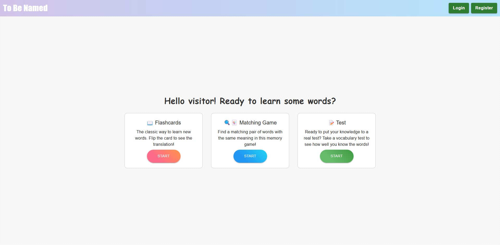

# 🌍 **Language Learning App**  
App to practise and create words with up to 6 languages supported.



## 🌟 **Features**
- **Authentication**: Secure JWT token-based user authentication.
- **Responsive Design**: Optimized for desktop and mobile devices.
---

## 🎯 **Tech Stack**
### Frontend:
- **React**:
- **Material UI**:

### Backend:
- **Node.js**
- **Express**

### Database:
- **SQLite**

---

## 🛠️ **Installation & Setup**
1. **Clone repository**
   ```bash
   git clone https://github.com/simoalanne/language-learning-app/
   
2. **Install dependencies**
   ```bash
   cd language-learning-app
   
3. **Create .env file to backend directory**
   ```bash
   JWT_SECRET=your_jwt_secret

4. **Run app locally with command**
   ```bash
   npm run start
   
---
## 📦 **Deployment**
The app can be also easily be run with docker. Here's how:
1. Build the container using `docker build -t language-learning-app .`  
2. Start the container with `docker run -p 3000:3000 language-learning-app`

---
## 🌐 **Link to Project in Cloud**
You can also access the project on: https://language-learning-app-f8vl.onrender.com/


## 🎥 **Screencast**  
[](https://www.youtube.com/watch?v=RLbBmv0AVQw)

---

## 👩‍💻 **Author**
**Simo Alanne** 

---
