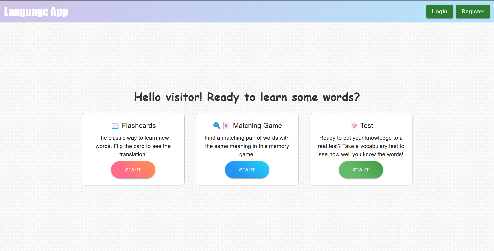
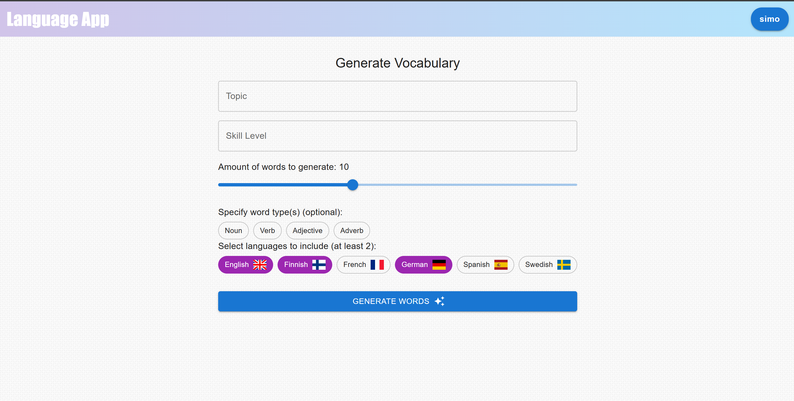
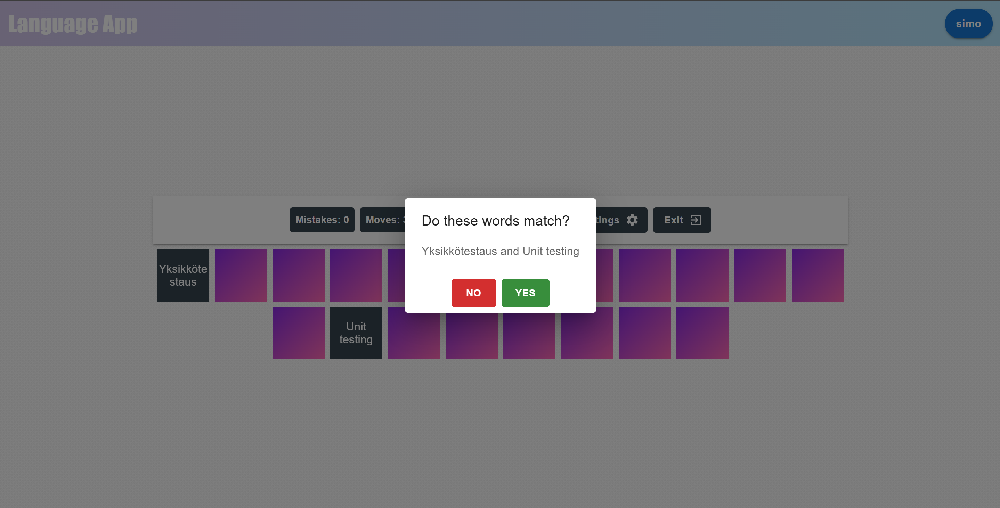
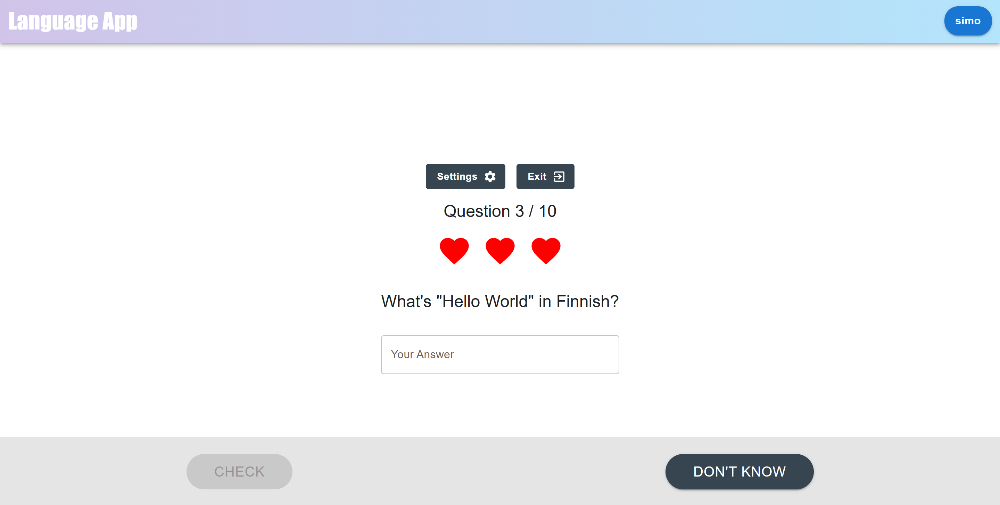
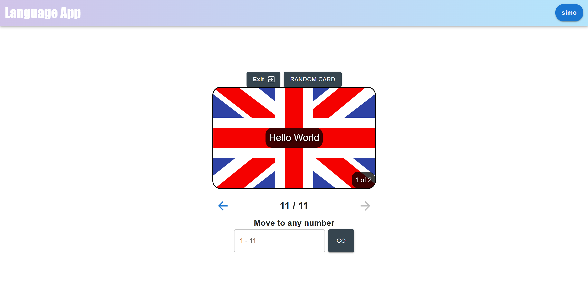

# 🌍 **Language Learning App**

App to practise and create words with up to 6 languages supported.

# 📌 Project Description

This app helps users expand their vocabulary across multiple languages. It's ideal for language learners who want customizable practise instead of being limited by what the app thinks they need to learn. Users can add new vocabulary seamlessly using AI for any topic they can think of.

## 📸 Screenshots

<div align="center"><br/>
    <br/>
    <em>Home Page</em>
</div><br/>

<div align="center"><br/>
    <br/>
    <em>Add Vocabulary with AI</em>
</div><br/>

<div align="center"><br/>
    <br/>
    <em>Matching Game Mode</em>
</div><br/>

<div align="center"><br/>
    <br/>
    <em>Test Mode</em>
</div><br/>

<div align="center"><br/>
    <br/>
    <em>Flashcards Mode</em>
</div><br/>

## 🌟 **Features**

- **AI-based vocabulary generation:** Users can create their own vocabulary to practise using an **LLM** or by themselves for full control.
- **Variety in learning modes:** From familiar **FlashCards** to **Matching Game** to just traditional **Test**, there is a mode that fits your way of learning the best.
- **Authentication**: Clerk-powered authentication with synced local user records.
- **Responsive Design**: Optimized for desktop and mobile devices.

---

## 🎯 **Tech Stack**

### Frontend:

- **React**
- **Material UI**

### Backend:

- **Node.js**
- **Express**

### Database:

- **PostgreSQL**

---

## 🛠️ **Installation & Setup**

1. **Clone repository**

   ```bash
   git clone https://github.com/simoalanne/language-learning-app/
   cd language-learning-app
   ```

2. **Install dependencies**

   ```bash
   pnpm install
   ```

3. **Create `.env` files**

   ```bash
   # backend/.env
   DATABASE_URL="your postgres connection string"
   CLERK_SECRET_KEY="your Clerk secret key"
   OPENAI_API_KEY="your OpenAI API key"
   OPENAI_MODEL="gpt-4o-mini"
   # Optional. Set to a positive number to enforce a per-user rolling 30-day quota.
   AI_GENERATION_LIMIT="25"
   # Optional, defaults to https://api.openai.com/v1
   OPENAI_BASE_URL="https://api.openai.com/v1"

   # frontend/.env
   VITE_CLERK_PUBLISHABLE_KEY="your Clerk publishable key"
   VITE_API_BASE_URL="http://localhost:3000"
   ```

4. **Run app locally with command**
   ```bash
   pnpm dev:backend
   pnpm dev:frontend
   ```

## 🌐 **Deployment**

Deployed project can be checked out here: https://lang-app.simoalanne.com
